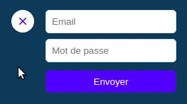

# Chatroom : Settings

> En travaillant sur le repo du projet `chatroom`

Ça commence à être vraiment sympa comme appli.

React, Redux, containers :tada: c'est vraiment cool; mais pour le moment le pseudo n'est pas top :/

On va prévoir ce qu'il nous faut pour la suite en ajoutant un formulaire de connexion.

## Créer le composant

- Créer un composant `Settings`
- Il contient un bouton qui servira à ouvrir/fermer la zone de settings
- Il contient un formulaire avec un champ email, un champ mot de passe et un bouton pour soumettre le formulaire
- On positionne la zone de settings en `fixed` en haut à droite de notre chatroom

## Gérer l'ouverture et la fermeture

- Dans l'état de notre application, on veut gérer l'état ouvert/fermé
- Au clic sur la croix on veut changer cet état
- Modifie ton composant, crée un container et l'action qui va bien et adapte le reducer pour accomplir cet objectif

## Champs contrôlés

Fais en sorte que les valeurs des 2 champs soient contrôlés par ton state

Ainsi on pourra facilement connaître les valeurs de ces champs pour gérer la connexion au prochain épisode :tada:

---

  

    Bonus : Un peu de CSS
  

## Animation

Fais en sorte d'avoir une transition sur l'affichage du formulaire, adapte ton code et exploite CSS pour cela

---

  

    Super bonus
  

- Créer un composant `Field` configurable via les props pour gérer les champs email et password
- Créer un container pour ce composant pour gérer nos champs contrôlés
- Gérer la modification de la valeur du champ via une seule et même action pour toutes les instances du composant `Field` :boom:

